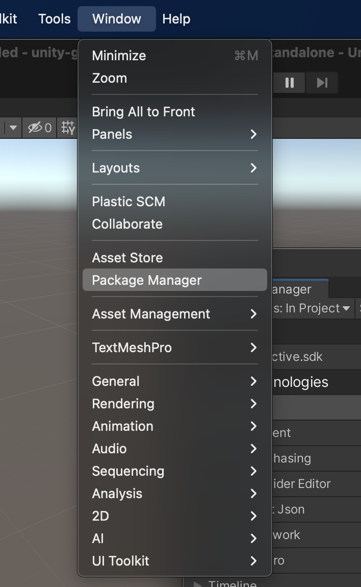
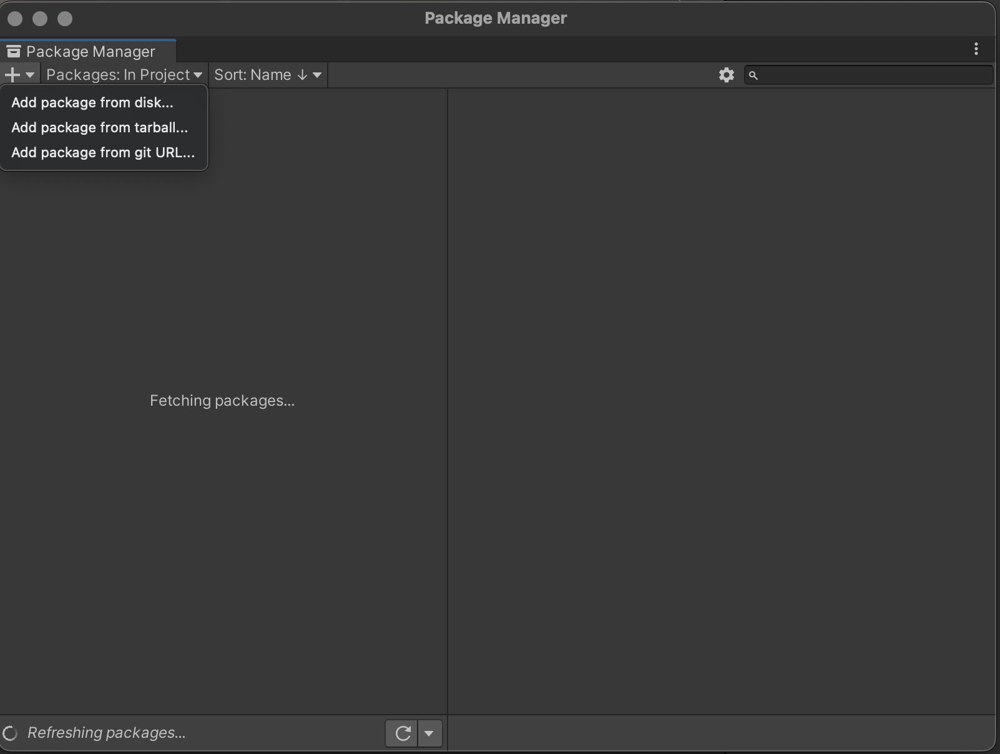
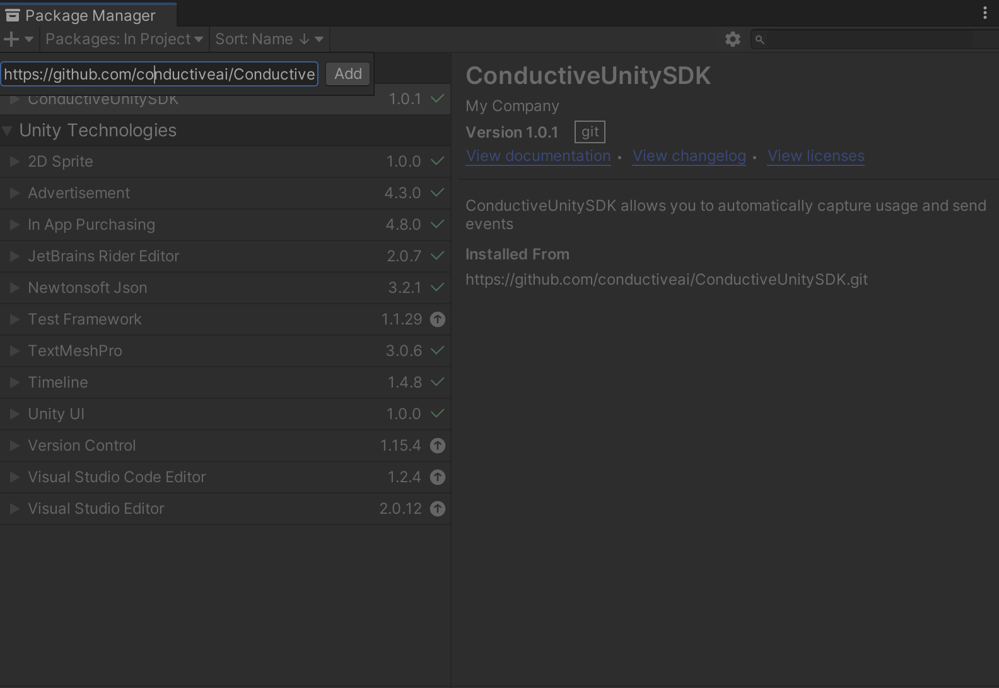
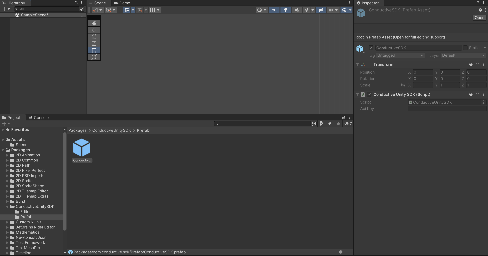

# CatalystSDK

## Overview

If you want to integrate **CatalystSDK** into your Unity game development project, this step-by-step guide will help you install the package into Unity.

## Requirements

Before we begin, make sure you have the following:

- Unity 2018 or later installed on your computer
- Internet connection
- GitHub account

## Installation

1. In Unity, go to **Window > Package Manager**  
2. Using the GitHub:
    1. In the ➕ button, go to **Add package from git URL**
    2. And paste <https://github.com/conductiveai/conductive-unity-sdk.git> and click **Add**
3. Using the ZIP file:
    1. Go to <https://github.com/conductiveai/conductive-unity-sdk.git> and download zip
    2. In the ➕ button, go to **Add package from disk**
    3. Select the zip file, that you download from GitHub.

- 
- 
- 

## Integration in Unity

1. In packages list, go to go to **Packages > CatalystSDK > Prefab**
2. Drag CatalystSDK prefab to your project's loading scene or first scene
    1. 
3. After filling the API_KEY field in the CatalystSDK prefab, the SDK will capture user login events automatically. No additional code needed! Placing the prefab in the game's first loaded scene or Main Menu ensures user logins are captured when the game starts.

## Usage

### Capture
  
Capture an event. This Catalyst function allows you to capture additional events in the game. You do not need to use Capture to capture daily logins.

```c#
CatalystSDK.Instance.Capture("ACTION", new Dictionary<string, object>{
    { "param1", Param1 },
    { "param2", Param2 },
    { "param3", Param3 },
    { "param4", Param4 }
});
```

### Alias

Create an alias, which Catalyst will use to link two distinct_id going forward (not retroactively). Multiple aliases can map to the same original ID, but not vice-versa.

```c#
CatalystSDK.Instance.Alias("DISTINCT_ID", "ALIAS");
```

### Identify

Identify a user with a unique ID instead of a Catalyst randomly generated distinct_id. If the method is never called, then unique visitors will be identified by a UUID generated the first time they visit the site.

```c#
CatalystSDK.Instance.Identify("DISTINCT_ID", new Dictionary<string, object>{
    { "age", Age },
    { "email": Email },
    { "name": Name }
});
```

### ScreenView
  
This method to track when the user views a specific screen in your game. You can pass new properties.

```c#
CatalystSDK.Instance.ScreenView("SCREEN_NAME", new Dictionary<string, object>{
    { "param1", Param1 },
    { "param2", Param2 },
    { "param3", Param3 },
    { "param4", Param4 }
});
```

### Manually capturing events

Here's an example code snippet that shows how to use the CatalystSDK in your game code

```c#
public class GameClassSomething : MonoSingleton {
  private int Coin;

  public void Start() {
    CatalystSDK.Instance.ScreenView("Game");
  }

  public void IncreaseCoin(int incCoin) {
    Coin += incCoin;

    CatalystSDK.Instance.Capture("IncreaseCoin", new Dictionary<string, object>{{ "coins", Coin }});
  }

  public void DecreaseCoin(int incCoin) {
    Coin -= incCoin;

    CatalystSDK.Instance.Capture("DecreaseCoin", new Dictionary<string, object>{{ "coins", Coin }});
  }

  public void Login(string email, int age, string name) {
    CatalystSDK.Instance.Identify(email, new Dictionary<string, object>{
      { "age", age },
      { "email": email },
      { "name": name }
    });
  }
}
```

## Troubleshooting

### Mac M1

### ************************************************Building for iOS / XCode************************************************

- If you’re receiving a CocoaPods error e.g. `...ruby/2.6.0/gems/ffi-1.15.5/lib/ffi_c.bundle' (mach-o file, but is an incompatible architecture (have 'arm64', need 'x86_64')),`
- This means you have `ffi` built for `arm64` but not `x86_64` architecture
- Make sure you have Developer Mode enabled on your iOS device, Settings → Privacy → Developer mode → on
- Do the following:

```python
# install llvm
arch -arm64 brew install llvm
export LDFLAGS="-L/opt/homebrew/opt/llvm/lib"
export CPPFLAGS="-I/opt/homebrew/opt/llvm/include"

# uninstall ffi
sudo gem uninstall ffi

# if prompted, uninstall ALL versions

# install ffi gem for x86_64
sudo arch -x86_64 gem install ffi
```

- Reference: <https://stackoverflow.com/questions/66644365/cocoapods-on-m1-apple-silicon-fails-with-ffi-wrong-architecture>

### Trouble building for iOS

- Be sure to disable bitcode
- Be sure to remove Quoted Include in Framework Header to no

[Changelog](CHANGELOG.md)
