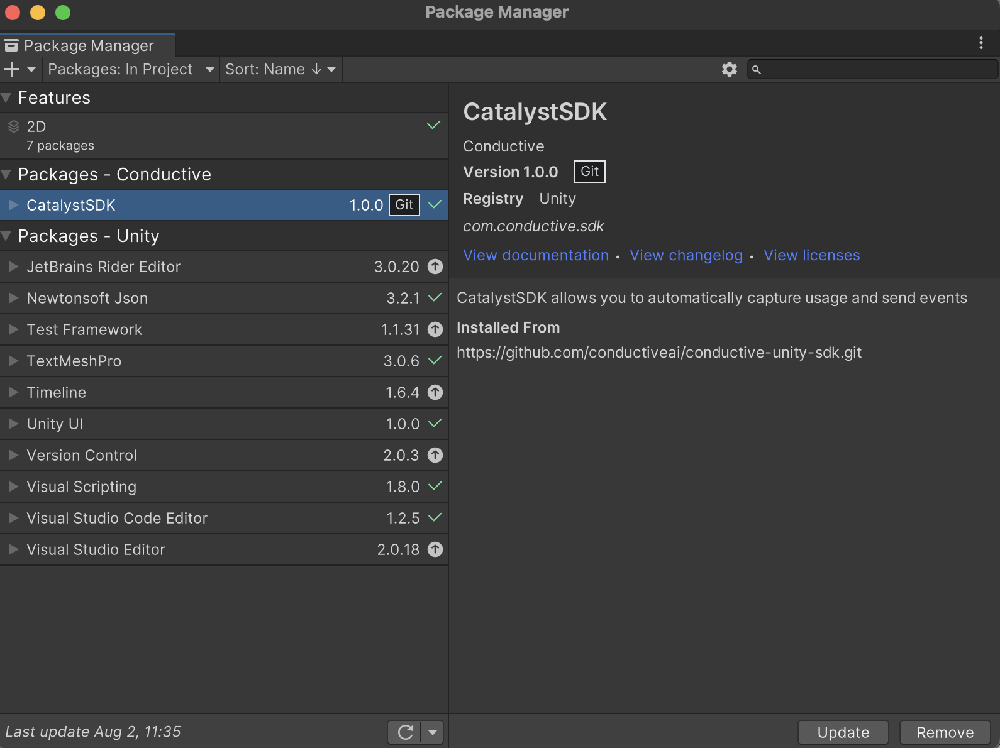

# Catalyst SDK

## Overview

If you want to integrate **Catalyst SDK** into your Unity game development project, this step-by-step guide will help you install the package into Unity.

You can follow our [docs](https://catalyst.conductive.ai/catalyst-unity-sdk/)

## Requirements

Before we begin, make sure you have the following:

- Unity 2018 or later installed on your computer
- Internet connection
- GitHub account

### API Key

You will first want to acquire an API key by visiting the dashboard <https://app.conductive.ai> and selecting the settings icon, followed by “Settings”


This should take you to the project settings below. Copy your API key provided for your project.


### Installing the Unity SDK

1. In Unity, go to **Window > Package Manager**. You can install the SDK using either the GitHub URL or the ZIP file.
2. Using GitHub:
    - Click the ➕ button, then go to **Add package from git URL**.
    - Paste <https://github.com/conductiveai/catalyst-unity-sdk.git> and click **Add**.
3. Using the ZIP file:
    - Go to [https://github.com/conductiveai/catalyst-unity-sdk](https://github.com/conductiveai/catalyst-unity-sdk.git) and [download the zip file](https://github.com/conductiveai/catalyst-unity-sdk/archive/refs/heads/main.zip)
    - Unzip the file
    - Click the ➕ button, then go to **Add package from disk**.
    - Select the folder that you unzipped select the package.json file.




### Integration in Unity

1. In the packages list, go to **Packages > CatalystSDK > Prefab**.

2. Drag the *CatalystSDK.prefab* to your project's loading scene or first scene

    

3. Fill in the `API_KEY` field in the *CatalystSDK.prefab* using the API key you acquired earlier.

4. Fill in the `SceneToShowButton` field in the *CatalystSDK.prefab* with the name of the Unity scene where you want the button to be shown. Pressing this button takes a user to the rewards interface where they can see contest information and their leaderboard rank.

 

5. Configure the `Canvas` and `Canvas Scaler` on the *CatalystSDK.prefab* to fit your game's UI. The button and webview for the rewards interface is rendered on this Canvas.

 

6. If you are creating leaderboard contests you will need to add a line of code when a player logs into your game to synchronize data with Catalyst services.

```csharp
CatalystSDK.Instance.SetExternalId("USER_ID_1");
```

Please refer to this page for more information: [Sending Events in Catalyst](https://catalyst.conductive.ai/sending-events-in-catalyst/)

## Usage

### Capture
  
Capture an event. This Catalyst function allows you to capture additional events in the game. You do not need to use Capture to capture daily logins.

```c#
CatalystSDK.Instance.Capture("ACTION", new Dictionary<string, object>{
    { "param1", Param1 },
    { "param2", Param2 },
    { "param3", Param3 },
    { "param4", Param4 }
});
```

### Alias

Create an alias, which Catalyst will use to link two distinct_id going forward (not retroactively). Multiple aliases can map to the same original ID, but not vice-versa.

```c#
CatalystSDK.Instance.Alias("DISTINCT_ID", "ALIAS");
```

### Identify

Identify a user with a unique ID instead of a Catalyst randomly generated distinct_id. If the method is never called, then unique visitors will be identified by a UUID generated the first time they visit the site.

```c#
CatalystSDK.Instance.Identify("DISTINCT_ID", new Dictionary<string, object>{
    { "age", Age },
    { "email": Email },
    { "name": Name }
});
```

### ScreenView
  
This method to track when the user views a specific screen in your game. You can pass new properties.

```c#
CatalystSDK.Instance.ScreenView("SCREEN_NAME", new Dictionary<string, object>{
    { "param1", Param1 },
    { "param2", Param2 },
    { "param3", Param3 },
    { "param4", Param4 }
});
```

### Set external ID

```c#
CatalystSDK.Instance.SetExternalId("USER_ID_1");
```

### Manually capturing events

Here's an example code snippet that shows how to use the CatalystSDK in your game code

```c#
public class GameClassSomething : MonoSingleton {
  private int Coin;

  public void Start() {
    CatalystSDK.Instance.ScreenView("Game");
  }

  public void IncreaseCoin(int incCoin) {
    Coin += incCoin;

    CatalystSDK.Instance.Capture("IncreaseCoin", new Dictionary<string, object>{{ "coins", Coin }});
  }

  public void DecreaseCoin(int incCoin) {
    Coin -= incCoin;

    CatalystSDK.Instance.Capture("DecreaseCoin", new Dictionary<string, object>{{ "coins", Coin }});
  }

  public void Login(string userId, string email, int age, string name) {
    CatalystSDK.Instance.SetExternalId(userId);

    CatalystSDK.Instance.Identify(email, new Dictionary<string, object>{
      { "age", age },
      { "email": email },
      { "name": name }
    });
  }
}
```

## Troubleshooting

### Mac M1

### ************************************************Building for iOS / XCode************************************************

- If you’re receiving a CocoaPods error e.g. `...ruby/2.6.0/gems/ffi-1.15.5/lib/ffi_c.bundle' (mach-o file, but is an incompatible architecture (have 'arm64', need 'x86_64')),`
- This means you have `ffi` built for `arm64` but not `x86_64` architecture
- Make sure you have Developer Mode enabled on your iOS device, Settings → Privacy → Developer mode → on
- Do the following:

```python
# install llvm
arch -arm64 brew install llvm
export LDFLAGS="-L/opt/homebrew/opt/llvm/lib"
export CPPFLAGS="-I/opt/homebrew/opt/llvm/include"

# uninstall ffi
sudo gem uninstall ffi

# if prompted, uninstall ALL versions

# install ffi gem for x86_64
sudo arch -x86_64 gem install ffi
```

- Reference: <https://stackoverflow.com/questions/66644365/cocoapods-on-m1-apple-silicon-fails-with-ffi-wrong-architecture>

### Trouble building for iOS

- Be sure to disable bitcode
- Be sure to remove Quoted Include in Framework Header to no

### Building for specific platforms 📱

iOS:

- Please include `Security.Framework` to your project in Xcode before you build. This is requirement to use Keychain services. For more information please check [Apple's documentation](https://developer.apple.com/documentation/security)

Android:

- Uniwebiew includes Android libraries that may have a duplicate class with other Android plugins. If you see errors refering to a duplicate class please check [Uniwebview's documentation](https://docs.uniwebview.com/guide/trouble-shooting.html#android)
